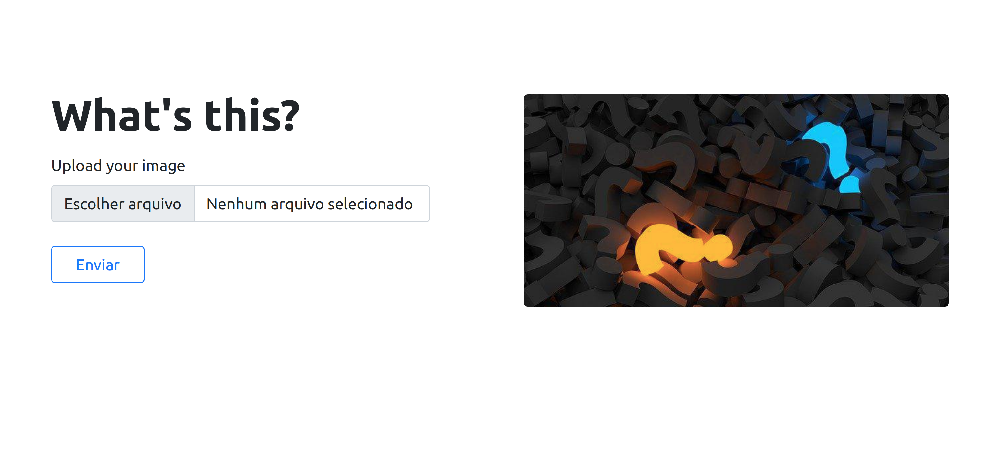

# What's this?

*What's this?* is a project for dealing with images you don't know.

## Demo

You can see the demo at [here](https://aqueous-island-14478.herokuapp.com/).



## Installation

Use the package manager [pip](https://pip.pypa.io/en/stable/) to install *What's this?*.

```bash
 pip install -r requirements.txt
```

## Run

```bash
python main.py
```

## Contributing
Pull requests are welcome. For major changes, please open an issue first to discuss what you would like to change.

Please make sure to update tests as appropriate.

## License
[MIT](https://choosealicense.com/licenses/mit/)